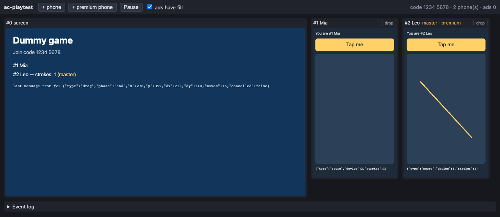

# ac-playtest

[](https://github.com/stixez/ac-playtest/actions/workflows/ci.yml)
[](LICENSE)
[](package.json)

**Offline, scriptable playtests for [AirConsole](https://www.airconsole.com) games.** It runs a local
simulation of the AirConsole platform (one TV screen plus any number of phones) in Chromium. You can play
in it by hand, or script whole sessions with [Playwright](https://playwright.dev) and run them in CI: phones
joining and leaving, taps and drags on the real controller UI, pause/resume and ads.



> **Unofficial.** ac-playtest is not affiliated with or endorsed by AirConsole / N-Dream AG. AirConsole is a
> trademark of its owner. It ships its own independently written stand-in for the AirConsole JS API and does not bundle
> any AirConsole code.

## Why

AirConsole games are two web pages: a `screen.html` on the TV and a `controller.html` on every phone. They talk
through AirConsole's JS API. The official simulator needs an AirConsole account and an internet connection, and
you can't script it. Unit tests don't run the real build.

ac-playtest grew out of play-testing a Unity WebGL game. Its first scripted run caught a release-blocking crash
that only happened in the WebGL build, when the lobby music started. The unit tests had all passed. With
ac-playtest that bug would have failed CI instead of reaching the upload.

- **Works offline, no account.** Serves your build and a local platform from one origin.
- **Faithful where it matters.** The stand-in API derives connect/disconnect, the master controller, custom
  states, active players and player silencing the same way the 1.11 library does. The opt-in test suite runs
  the **official** library against the simulator and passes the same 16 behaviour tests
  ([Fidelity](#fidelity)).
- **Real input.** Phone taps and drags are trusted touch events (pointer + touch + click), so they work on
  buttons and on canvases.
- **Built for CI.** Headless, works with `node --test` or any test runner, and catches console errors,
  including the ones a Unity template hides with `window.onerror`.

## Quick start

```sh
npm install --save-dev ac-playtest
npx ac-playtest serve ./Builds/WebGL --open          # play by hand: screen + 2 phones in your browser
```

Scripted playtests need Chromium. ac-playtest uses Playwright's Chromium if it is installed
(`npx playwright-core install chromium`), and otherwise falls back to your installed Google Chrome.

```js
// playtest.mjs
import { launch } from 'ac-playtest';

const sim = await launch({ build: './Builds/WebGL', phones: 0 });   // headless by default
try {
  const mia = await sim.addPhone({ nickname: 'Mia' });
  const leo = await sim.addPhone({ nickname: 'Leo', premium: true });

  await mia.tap('Join Team Red');                                    // visible text, selector or {x, y}
  await leo.drag({ x: 80, y: 300 }, { x: 260, y: 180 }, { steps: 12 }); // e.g. an aim pad on a canvas
  await sim.waitForMessage({ from: 0, to: mia.id, type: 'view' });   // what the screen sent to Mia

  await sim.dropPhone(leo);                                          // bad wifi...
  await sim.reconnect(leo.id);                                       // ...same device id again
  await sim.pause();
  await sim.resume();

  await sim.screenshot('out/lobby.png');
  if (sim.consoleErrors().length) throw new Error(JSON.stringify(sim.consoleErrors(), null, 2));
} finally {
  await sim.close();
}
```

[`examples/playtest.mjs`](examples/playtest.mjs) is a complete script that drives
[`examples/dummy-game`](examples/dummy-game), a tiny plain-HTML AirConsole game. Run it with
`npm run example`.

## CLI

```
ac-playtest serve <buildDir> [options]

  <buildDir> must contain screen.html and controller.html (or the --path folder below it must).

  --path <dir>        the game's folder inside <buildDir>, for games that load shared files from parent
                      folders (../styles/...); <buildDir> is then the web root
  --port <n>          port (default 8080; 0 = any free port)
  --host <addr>       interface to bind (default 127.0.0.1)
  --phones <n>        phones that join when the page opens (default 2)
  --scale <f>         display scale of the frames (default 0.5)
  --api-version <v>   version the stand-in API reports (default: the one in the game's script tag)
  --official-api      use the official API from airconsole.com instead of the stand-in (needs internet)
  --open              open the sim page in the default browser
```

The sim page has buttons to add (premium) phones, pause/resume and toggle ad fill. Each phone has drop and
reconnect buttons, and there is a live event log. `http://localhost:8080/` redirects to the sim page, at
`/__ac/sim.html`. Query parameters such as `?phones=4&scale=0.4&latency=50` configure it.

## Scripting API

`import { launch } from 'ac-playtest'`. Types are in [`index.d.ts`](index.d.ts).

### `launch(options) → Promise<Sim>`

| option | default | |
| --- | --- | --- |
| `build` | (required) | folder with `screen.html` and `controller.html`; with `path`, the web root above the game |
| `path` | `''` | the game's folder inside `build`, e.g. `'example-premium/'`, for games that load `../shared` files |
| `phones` | `0` | phones connected before `launch` resolves |
| `headless` | `true` | |
| `api` | `'builtin'` | `'official'` loads the real library from airconsole.com |
| `apiVersion` | tag version | version the stand-in reports |
| `browser` | | a Browser to reuse (e.g. one per test file); `close()` leaves it open |
| `channel`, `executablePath`, `browserArgs`, `mute` | | browser selection; audio muted by default |
| `readyTimeout` | `60000` | ms to wait for the screen's `new AirConsole()` |
| `timeout` | `10000` | default for the `waitFor*` helpers |
| `screenSize`, `phoneSize`, `scale` | 1280×720, 360×640, 1 | frame sizes (CSS px); phones rotate on `setOrientation` |
| `viewport` | fits screen + 2 phones | the screen plus two phones beside it, in either orientation, without scrolling |
| `code` | `'1234 5678'` | join code passed to `onReady` |
| `adDuration`, `adFill` | `2500`, `true` | ad behaviour |
| `latency` | `0` | extra ms on every platform → device message |
| `language`, `translations` | `'en'` | `translations: { en: { id: 'text' } }` |
| `gameConfiguration`, `gameSafeArea` | not sent | sent to the screen when set |
| `serverTimeOffset` | `0` | |
| `persistentData` | `{}` | initial `{ uid: { key: value } }` |

### `Sim`

| | |
| --- | --- |
| `sim.screen` | the screen `Device` (id 0) |
| `addPhone({ nickname, uid, premium, language })` | connects a phone (a fresh `controller.html`); resolves when its API is ready and the others got `onConnect` |
| `dropPhone(idOrPhone)` | removes the phone; the others get `onDeviceStateChange(id, undefined)` + `onDisconnect` |
| `reconnect(id)` | same id, nickname and uid; a new page load |
| `phones()`, `device(id)` | connected phones / any device |
| `pause()`, `resume()` | screen gets `onPause` / `onResume` |
| `setPremium(id)`, `setNickname(id, name)`, `setAdFill(bool)`, `deviceMotion(id, data)`, `setSafeArea(area)` | platform events |
| `messages(filter)`, `lastMessage(filter)` | messages as they left the sender: `{ seq, time, from, to, data }`, with `to: 'all'` for broadcasts |
| `waitForMessage(filter, { timeout, since })` | first match since `since` (default: whole history) |
| `events(filter)`, `waitForEvent(filter, opts)` | everything recorded (see below) |
| `mark()` | current sequence number; pass it as `since` to only wait for new things |
| `ads()` | one entry per `showAd()`: `{ requestedAt, shown, completedAt }` |
| `consoleErrors({ ignore })`, `consoleMessages()` | console errors, uncaught exceptions and API-reported errors, from every frame |
| `screenshot(file, { of: 'page' \| 'screen' \| id })` | PNG |
| `await state()` | platform snapshot (a Promise): devices, players, paused, master, high scores, persistent data |
| `page`, `context`, `browser`, `cdp()` | Playwright escape hatches |
| `close()` | |

**Message filters** are `{ from, to, type }` or a function. `type` matches `data.type`, a common convention.
`to: n` also matches broadcasts that reached device `n`.
**Event filters** match fields exactly, e.g. `{ type: 'connect', device: 2 }`.
Event types: `ready`, `join`, `connect`, `disconnect`, `message`, `custom`, `players`, `ad` (`phase`:
`request`/`show`/`complete`), `pause`, `resume`, `premium`, `profile`, `navigate`, `vibrate`, `orientation`,
`immersive`, `highScoreStored`, `highScores`, `persistentStore`, `persistentRequest`, `jserror`, `set`.

Taps and drags work on any phone, wherever it sits on the sim page: the page is scrolled to bring the target
into the viewport first (games' `position: fixed` layouts can't do that themselves).

Events reach Node asynchronously. Use `waitFor*` instead of sleeping. To avoid matching something old, take
`const since = sim.mark()` *before* the action that triggers it.

### `Device` (the screen and each phone)

| | |
| --- | --- |
| `id`, `frame`, `page`, `frameElement` | Playwright `Frame` of the device; the sim `Page`; its `<iframe>` locator |
| `tap(target, { pointerType })` | `target`: visible text, a selector (`#id`, `.cls`, `[attr]`, `css=`, `text=`, `role=`, `xpath=`), a Locator, or `{ x, y }` in device CSS px. Touch by default, `'mouse'` optional |
| `drag(from, to, { steps, duration, hold, pointerType })` | trusted touch (or mouse) drag; points or elements. Both ends must fit in the viewport at once |
| `locator(target)` | Playwright Locator in the device frame |
| `evaluate(fn, arg)` | run code in the device frame, e.g. `sim.screen.evaluate(() => airconsole.getMasterControllerDeviceId())` |
| `send(data, to)` | inject a message as if this device sent it |
| `messages(filter)`, `lastMessage(filter)`, `waitForMessage(filter, opts)` | messages **delivered to** this device (sent to it, or broadcast by another device). To wait for what a phone *sends*, use `sim.waitForMessage({ from: phone.id })` |
| `sent(filter)` | messages this device sent |
| `screenshot(file)` | PNG of this frame |

### In a test runner

```js
import { test, before, after } from 'node:test';
import assert from 'node:assert/strict';
import { launch, launchBrowser } from 'ac-playtest';

let browser;
before(async () => { browser = await launchBrowser(); });
after(() => browser.close());

test('the host can start a match', async (t) => {
  const sim = await launch({ build: './Builds/WebGL', browser, phones: 2 });
  t.after(() => sim.close());
  const [host] = sim.phones();
  await host.tap('START');
  await sim.waitForMessage({ from: 0, type: 'view' });
  assert.deepEqual(sim.consoleErrors(), []);
});
```

In GitHub Actions, install a browser first: `npx playwright-core install --with-deps chromium`. (Ubuntu
runners also have Google Chrome preinstalled, which ac-playtest uses as a fallback.)

## Unity WebGL notes

- **Compression.** Unity builds made without *Decompression Fallback* ship `*.br` (or `*.gz`) files and need
  the server to send `Content-Encoding: br` (`gzip`) with the original MIME type, e.g. `application/wasm`.
  There is no fallback. ac-playtest's server does this, sends `Cache-Control: no-store`, and serves everything
  from one origin so all frames are same-origin.
- **Unset fields must stay `undefined`, never `null`.** The Unity plugin forwards `translations`,
  `gameSafeArea` and `gameConfiguration` from `onReady` to C#. A JSON `null` there crashed the plugin's cast.
  The simulator only sends these when you configure them; a test enforces this.
- **Waiting for Unity.** `new AirConsole()` (and so `launch()`) completes long before Unity has loaded.
  Wait for the game instead, e.g.
  `await sim.screen.frame.waitForFunction(() => window.app?.is_unity_ready, null, { timeout: 120000 })`, or
  wait for the first message your game sends.
- **Crashes.** The AirConsole Unity template installs a `window.onerror` that returns `true`, which hides
  uncaught errors from the console and from Playwright. The API still reports them to the platform, and
  `consoleErrors()` includes those reports (`type: 'jserror'`). WebGL aborts such as
  `RuntimeError: memory access out of bounds` show up there.
- WebGL in headless Chromium renders in software (SwiftShader). It is fine for logic and crash testing; don't
  judge frame rates by it.

## Tested with

| Game | API mode | Result |
| --- | --- | --- |
| A Unity WebGL game: Unity 6, AirConsole Unity plugin 2.6, landscape controllers, Brotli build | built-in and official | Full scripted matches pass in both modes: lobby, START, 10 slingshot shots by touch drag, mid-flight taps, drop/reconnect, pause/resume, no console errors. Dogfooding it found two harness bugs (input on phones outside the viewport; Unity taking the frame fullscreen), both fixed with tests. Its first run caught a real WebGL-only crash in the game |
| [airconsole-scaffold](https://github.com/AirConsole/airconsole-scaffold) | built-in and official | Passes: connect log, message and reply, the cube, disconnect |
| [airconsole-api-examples](https://github.com/AirConsole/airconsole-api-examples) (overview, device states, premium, profile, persistent data; served with `path`) | built-in and official | Device states, premium and profile behave as intended. The two modes produced identical event logs, screen/phone text and console errors, except for the profile-picture URL (local SVG vs airconsole.com) |

Honest notes:

- The persistent-data example throws `A valid array of uids must be provided on the screen` in **both** modes. It
  calls `requestPersistentData()` / `storePersistentData()` on the screen without uids, which API 1.9+ rejects.
  The example predates that change; it is not a simulator bug, and it shows the official client agreeing with the
  stand-in.
- The examples' overview logs `Path does not exist!` for its "Active Players" entry, which has no target folder
  (also in both modes).
- The examples load jQuery, fonts and CSS from CDNs, so they need the internet even with the built-in API. Your
  own game runs offline if it bundles its assets.
- Only Chromium has been used. Phaser, Construct and other HTML5 engines use the same JS API and should work, but
  haven't been tried on a real project yet. Reports are welcome.

## How it works

```
sim page (/__ac/sim.html, platform.js)            the simulated AirConsole platform
 ├─ <iframe> /screen.html      ── postMessage ──►  device list, message routing (JSON round-trip),
 ├─ <iframe> /controller.html  ◄── postMessage ──  ads, pause/resume, premium, high scores, persistent data,
 └─ <iframe> /controller.html                      event log ──► Node (Playwright binding)
```

The server rewrites `<script src="https://www.airconsole.com/api/airconsole-X.js">` in served HTML to
`/__ac/api/airconsole-X.js`, the stand-in. Like the real library, the stand-in is a thin client: it posts
`ready` / `message` / `set` to its parent window and gets `ready` / `message` / `update` / `ad` / `pause` / … back.
Because the platform speaks that protocol, the official library can run against it unchanged (`--official-api`).
That is how the fidelity tests compare the two.

## Fidelity

ac-playtest implements the AirConsole JS API **1.11** surface. The behaviour comes from the API documentation
and the public 1.11 client library. The platform side (what AirConsole's servers do) is a model, and where real
behaviour couldn't be verified it is listed below as simplified or not modelled rather than guessed silently.
Rows marked ✓ are covered by `test/support/api-suite.js`, which passes with both the stand-in and the official
library (`npm run test:official`).

### Modelled

| Feature | Notes |
| --- | --- |
| ✓ `onReady(code)`, then `onConnect` for devices already in the game | also replays `onCustomDeviceStateChange`, `onActivePlayersChange`, `onPremium` for them |
| ✓ connect / disconnect | `onDeviceStateChange(id, data)` then `onConnect`; `onDeviceStateChange(id, undefined)` then `onDisconnect`. Derived from device locations, like the real client |
| ✓ device ids | screen 0, phones from 1, never reused, kept on reconnect |
| ✓ `message` / `broadcast` / `onMessage` | asynchronous; JSON round-trip (`undefined` dropped, `NaN` → `null`, `Date` → string); a broadcast skips its sender; messages to unknown devices are dropped |
| ✓ `getMasterControllerDeviceId` | premium devices first, then the lowest connected id |
| ✓ `getControllerDeviceIds`, `getNickname` (`"Guest N"` fallback), `getUID`, `isPremium`, `getPremiumDeviceIds` | |
| ✓ custom device state | `setCustomDeviceState`, `setCustomDeviceStateProperty` (merge), `getCustomDeviceState`, `onCustomDeviceStateChange` |
| ✓ active players | `setActivePlayers` (screen only), `getActivePlayerDeviceIds`, `convert*`, `onActivePlayersChange` |
| ✓ player silencing | client-side logic as in the 1.11 library: on by default unless the game loads `airconsole-latest.js`. While players are set, devices that aren't players are silenced: their messages are dropped, and their connect/state updates are held until `setActivePlayers(0)` replays them (a connect followed by a disconnect cancels out). The sim UI overlays silenced phones |
| ✓ ads | `showAd` (screen only) → `onAdShow` on every device → `onAdComplete(true)` after `adDuration`; with no fill only `onAdComplete(false)` |
| ✓ `onPause` / `onResume` | screen only, when you call `sim.pause()` / `sim.resume()` |
| ✓ `synchronize_time` / `getServerTime` | throws without `synchronize_time`; offset configurable |
| ✓ `translation` / `getTranslation` / `getLanguage` | translations only sent when the device asked for them and you configured them; `%name%` substitution |
| ✓ `getGameConfiguration`, `onSetSafeArea` | only when configured; otherwise `undefined` / `{}` |
| ✓ high scores, persistent data | in memory, answered through `onHighScoreStored` / `onHighScores` / `onPersistentDataStored` / `onPersistentDataLoaded` |
| ✓ `getPremium` / `onPremium`, profile changes / `onDeviceProfileChange` | via `sim.setPremium` / `sim.setNickname` too |
| ✓ `onDeviceMotion` | data comes from `sim.deviceMotion()` |
| `orientation` / `setOrientation` | recorded; the phone frame rotates |
| `setup_document` | viewport meta, no text selection, `touchmove` default prevented |
| uncaught errors | reported to the platform as `jserror`, like the real library |

### Simplified

| Area | What differs or is unverified |
| --- | --- |
| join timing | phones load `controller.html` only after the screen's API is ready. On AirConsole phones may load in parallel, so a screen's `onReady` can already see controllers |
| device data | `uid`, `nickname`, `location`, `custom`, `language`, `premium`, `auth: false`, `slow_connection: false`; the screen also has `silencePlayers`, `players`. Real device data has more (client info, environment, picture…) |
| update echo | state updates (custom state, active players) go to the *other* devices only. Whether AirConsole also echoes them to the device that made the change is unverified |
| devices before loading | real phones may appear in `devices` (and fire `onDeviceStateChange`) before they load the game; here they appear when their API is ready |
| premium | `getPremium()` upgrades at once (documented for development mode) and notifies every device |
| profile pictures | a generated SVG from the local server instead of an airconsole.com URL |
| high scores | one global list per level name + version; only a `world` rank; no friends, regions or share URLs |
| persistent data | per sim run, no size limit; unknown uids load as `{}` |
| ads | fixed duration and a fill switch; no frequency rules |
| pause | only when you trigger it; when the real platform pauses (menus, app switching) isn't modelled |
| network | optional fixed latency; no jitter, loss or `slow_connection` changes |
| defaults | join code `1234 5678`; phones start in portrait until the controller sets an orientation (the real default is unverified) |
| silenced phones | an overlay in the sim; whatever AirConsole shows them is not reproduced |
| fullscreen | game frames may not go fullscreen (`document.fullscreenEnabled` is false), so a game can't cover the other devices; what AirConsole's frames allow is unverified |

### Not modelled

- `navigateHome`, `navigateTo`, `openExternalUrl`: recorded (`navigate` / `set` events), never executed.
- `vibrate`, `setImmersiveState`: recorded only.
- `requestEmailAddress`, `editProfile`: recorded; `onEmailAddress` never fires; nobody is logged in.
- `getUserMedia`: argument checks as documented; valid requests are always denied (`PermissionDenied`).
- AirConsole's own UI (menus, join screen, overlays), native apps / Android TV game sizing, the Unity editor
  websocket mode, multi-screen environments, partner configuration.
- The official library's extras (Unity download retry/range loader, performance reporting). These only run
  with `--official-api`.
- Reloading the screen frame mid-session (relaunch instead); compressed HTML (`screen.html.br`) is not
  rewritten.

## Limitations

- **Tested games.** A Unity WebGL game and AirConsole's own plain-HTML scaffold and API examples (see
  [Tested with](#tested-with)). Other engines haven't been tried on a real project yet.
- Chromium only (Playwright's Chromium or Google Chrome); trusted touch input uses the Chrome DevTools
  Protocol.
- One session per sim. Run several sims for several sessions.
- The recorded event log is capped at 200,000 events per sim.

## Development

```sh
npm install
npm test                                  # server, harness and API behaviour tests (headless)
AC_PLAYTEST_OFFICIAL=1 npm run test:official   # the same behaviour tests against the official library (internet)
npm run serve:example                     # the dummy game in your browser
```

See [CONTRIBUTING.md](CONTRIBUTING.md).

## License

[MIT](LICENSE) © 2026 Zvonimir. AirConsole is a trademark of its owner; this project is not affiliated with
or endorsed by AirConsole / N-Dream AG.
